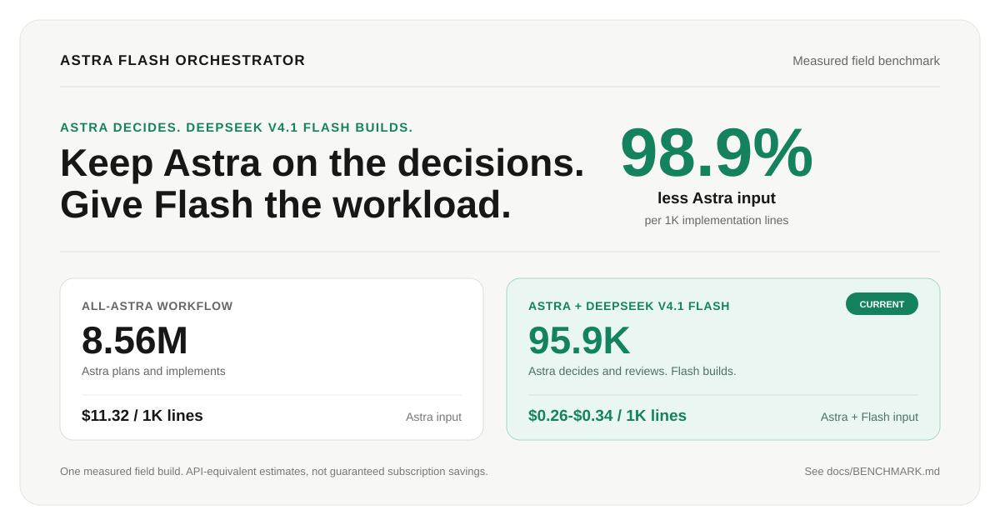

# Astra Flash Orchestrator

**Save Astra for the decisions that need it. Let DeepSeek V4.1 Flash do the volume.**



A personal Codex skill designed to preserve Astra usage without giving up Astra's
judgment. Astra stays responsible for planning, architecture, high-stakes
decisions and final review. DeepSeek V4.1 Flash takes the high-volume work:
repository discovery, implementation, testing, debugging and routine verification.
Flash is the default worker, and an operator can pin one other already-configured
reviewed route instead when a task needs it.

Bring an existing plan or start with a feature request. The workflow turns it
into coherent implementation bundles, sends those bundles to the installed worker
route, then returns the completed patch and evidence to Astra for one focused
acceptance pass.

> **Status:** early release. Offline installation tests pass, and the workflow has completed a measured local field build. Results below describe that run, not guaranteed savings. A new installation still needs runtime routing verification on its first authorized task. Installation never runs paid inference.

## Measured efficiency

In one substantial field build, Astra Flash Orchestrator used **98.9% less Astra
input per 1,000 implementation and test lines** than the all-Astra baseline. It
did that by moving the implementation loop—not the important decisions—to Flash.
Total API-equivalent compute per 1,000 lines was **97.0–97.7% lower**, while the
measured phase produced 39% more implementation and test lines.

| Workflow | Astra input per 1K implementation lines | Total compute per 1K lines |
| --- | ---: | ---: |
| All Astra | 8.56M | $11.32 |
| Astra + DeepSeek V4.1 Flash | **95.9K** | **$0.26–$0.34** |

The per-token price difference explains why delegating implementation has so
much leverage:

| Cost per 1M tokens | Astra estimator | DeepSeek V4.1 Flash | Astra premium |
| --- | ---: | ---: | ---: |
| Uncached input | $10.00 | $0.15–$0.30 | 33–67× |
| Cached input | $1.00 | $0.003–$0.006 | 167–333× |
| Output | $50.00 | $0.60–$1.20 | 42–83× |

Astra does not have a public API SKU; its values above are API-equivalent
estimates, not ChatGPT or Codex subscription charges. Flash values use published
off-peak and peak API rates. See the [benchmark methodology](docs/BENCHMARK.md)
for sources, exact measurements and limitations.

## How it works

```text
Astra  →  scope + design + task brief
Flash  →  implement + test + report
Astra  →  review + verify + accept or request fixes
       →  integrate + checkpoint + next task
```

- **Native delegation:** uses the `astra_flash_builder` role, not a separate agent CLI.
- **Coherent assignments:** one feature slice can include many edit/test/fix steps.
- **Focused Astra root:** normally one planning batch, one dispatch, one wait, one
  batched acceptance review and one final response.
- **Worker-owned execution:** the installed worker route handles in-scope
  discovery, implementation, testing, debugging and routine browser/visual QA
  without progress polling.
- **Review before acceptance:** the builder submits evidence; Astra decides whether it is complete.
- **Existing plans welcome:** works with repository plans, Superpowers/GSD artifacts, or the included templates.
- **Controlled parallel work:** one writer by default; two only with independent tasks and verified separate workspaces.
- **Reversible installation:** dry run, backups and a guarded undo receipt.

This is workflow guidance, not a deterministic scheduler, a security sandbox, or a guarantee of model quality or cost savings. It is independent of OpenAI, DeepSeek and Codex Router.

### One orchestration workflow

There is no mode setting or mode-switch command. The package always uses the
usage-saving Astra → worker → Astra workflow for substantial implementation.

Three routing outcomes remain intentionally different:

- Substantial implementation uses Astra to plan and review while the installed
  worker builds; DeepSeek V4.1 Flash is the default worker route.
- Trivial work and explicit single-agent requests stay with the root session.
- Concrete security, architecture, payments, tenancy, secrets, migration or
  production risk can justify targeted additional Astra review.

Those are scope and safety decisions, not user-selectable performance modes.

## Requirements

Before installing, you need:

1. A Codex client that supports native subagents and standalone custom agent TOML files under `$CODEX_HOME/agents/`.
2. GPT-6 Astra selected as the root model, or another orchestrator you run at the root (for example GPT-5.6 Terra). The installer refuses a root that is one of the DeepSeek V4.1 Flash routes and never changes the root itself; any other root model is accepted as-is.
3. Python **3.11 or newer**. No third-party Python dependencies are needed.
4. An existing [Codex Router installation](https://github.com/duolahypercho/codex-router), configured and authenticated for the worker route you intend to pin (DeepSeek V4.1 Flash by default; see the route tables below).
5. A local Codex model catalog advertising that exact route with `multi_agent_version: "v2"`.

| Provider | Worker route |
| --- | --- |
| DeepSeek API (default) | `deepseek/deepseek-v4.1-flash` |
| OpenRouter | `openrouter/deepseek-v4.1-flash` |
| opencode Go | `opencode-go/deepseek-v4.1-flash` |
| Command Code | `commandcode/deepseek-v4.1-flash` |
| Nous Research | `nousresearch/deepseek-v4.1-flash` |
| Ollama Cloud | `ollama-cloud/deepseek-v4.1-flash` |

### Other reviewed worker routes

These routes are accepted by the same `--worker-route` option and are subject to
the same fail-closed checks. Nothing here is selected automatically.

| Provider | Worker route | Prerequisite |
| --- | --- | --- |
| DeepSeek API | `deepseek/deepseek-v4-pro` | advertised as `v2` |
| xAI Grok OAuth | `grok-oauth/grok-4.6` | advertised as `v2` |
| xAI Grok OAuth | `grok-oauth/grok-4.5` | currently published as `v1`; enable that exact route first |
| OpenRouter | `openrouter/claude-fable-5.1` | advertised as `v2` |
| Local Ollama | `local/<ollama-tag>`, e.g. `local/qwen3.8:27b-mlx` | that exact model enabled in the Router and advertised as `v2` |

The installer reads the catalog your session actually uses, so it rejects a route
that is missing, duplicated, or still published as `v1`. Ollama cloud aliases
(`<model>:cloud` and `<model>:<size>b-cloud`) are refused under `local/`, because
those are served from Ollama's cloud. A `local/` slug only records which namespace
the Router published; it is not evidence that inference runs on your machine. Use
the Router's `ollama-cloud` provider route for those models.

The role name stays `astra_flash_builder` in every case for install and update
compatibility; its model field is the route you pinned. If the root model and the
worker route are the same, installation continues and warns, because one model can
serve both roles while keeping their responsibilities separate. The root model, root effort,
provider URLs and credentials are never rewritten.

### Named builders: several pinned roles at once

A root session running Astra or Terra can keep several builders installed at the
same time and name the one it wants for a task. Each `--builder` install writes
only that role's agent file and its own binding, so installing or updating one
role never changes another:

| `--builder` | Native role | Label | Pinned route |
| --- | --- | --- | --- |
| `grok` | `astra_terra_builder_grok` | Astra/Terra builder Grok | `grok-oauth/grok-4.6` (override: `grok-oauth/grok-4.5`) |
| `fable` | `astra_terra_builder_fable` | Astra/Terra builder Fable | `openrouter/claude-fable-5.1` |
| `deepseek-flash` | `astra_terra_builder_deepseek_flash` | Astra/Terra builder DeepSeek Flash | `deepseek/deepseek-v4.1-flash` |
| `deepseek-pro` | `astra_terra_builder_deepseek_pro` | Astra/Terra builder DeepSeek Pro | `deepseek/deepseek-v4-pro` |
| `grok-4-5` | `astra_terra_builder_grok_4_5` | Astra/Terra builder Grok 4.5 | `grok-oauth/grok-4.5` |
| `ollama` | `astra_terra_builder_ollama` | Astra/Terra builder Ollama (local) | `local/<ollama-tag>`, named on the first install |

```sh
python3 -B install.py --builder grok --replace
python3 -B install.py --builder grok --replace --apply
python3 -B install.py --builder fable --replace --apply
python3 -B install.py --builder deepseek-flash --replace --apply
```

`--worker-route` refines a preset only inside it: `grok` accepts 4.6 or 4.5;
`fable`, `deepseek-flash`, `deepseek-pro` and `grok-4-5` accept their exact route;
`ollama` requires a configured `local/<ollama-tag>` the first time. A route from
another preset is refused before any file is written.

Bindings live beside the installed skill as `builders/<role>.json`, one per role
and separate from the legacy `routing.json`. Check one role at any time:

```sh
python3 -B skill/astra-flash-orchestrator/scripts/doctor.py --builder grok
```

Running the installer without `--builder` still installs or updates the legacy
`astra_flash_builder` worker and its `routing.json`; that path is untouched by
named builders, and named bindings are untouched by it. Undo restores exactly the
role named in the receipt and refuses unknown role or binding paths. The first
install owns the shared skill files and the managed policy, so undo in reverse
install order: a receipt that owns those shared files is refused while another
builder is still installed, because that builder would be left without the skill.

Provider credentials are entered by you through Codex Router's private local
prompt before installing this package. Never paste an API key into an assistant
chat. This installer never asks for, reads, stores or validates provider keys.

> **Do not spend API credit during installation.** Installing this package does
> not authorize an assistant to run `subagents certify`, `test-model --live`, a
> Router smoke test or any other paid inference probe. If the selected route is
> absent or is not already advertised as `v2`, the installer stops and reports
> the prerequisite. Decide separately whether to certify a route yourself.

Do **not** add or change `[agents].default_subagent_model` for this package. The
installer creates a named `astra_flash_builder` role that pins its own route and
catalog-supported effort, so unrelated subagents keep their existing defaults.
The installer **does not install the Router, add credentials, select your root
model, enable a provider, or rewrite `config.toml`**. Direct DeepSeek V4.1 Flash
remains the default. Any other route requires an explicit `--worker-route`; if
that route is unavailable, installation stops instead of silently choosing
another provider.

The installer supports loopback Router URLs using `/v1` or `/_codex-router/<capability>/v1`. It rejects remote hosts, embedded credentials, queries, fragments and unexpected paths. Client/project/UI overrides still need checking in your actual session. Router subagent selection enables discovery; it does not prove successful inference. Some Router enable commands automatically launch paid verification, so inspect the installed version before changing selection. This installer never enables routes or runs those probes.

## Install

Download this repository as a ZIP and extract it, or clone the maintained fork:

```sh
git clone https://github.com/JaredReabow/astra-flash-orchestrator.git
cd astra-flash-orchestrator
```

This fork tracks upstream [ethanplusai/astra-flash-orchestrator](https://github.com/ethanplusai/astra-flash-orchestrator)
and keeps its attribution and license.

Run the following commands from that repository folder.

### Fastest safe terminal install

The installer performs its own prerequisite checks before writing. Preview the
exact destinations, then apply:

```sh
python3 -B install.py
python3 -B install.py --apply
```

That is the normal installation path. The first command changes nothing. The
second repeats preflight, installs atomically, backs up existing instructions and
prints a guarded undo receipt. It does not change your root model, Router,
credentials, permissions or reasoning effort.

To use an already-configured alternate route, pass its exact slug to both
commands. For OpenRouter, a Grok OAuth route, or a local Ollama model:

```sh
python3 -B install.py --worker-route openrouter/deepseek-v4.1-flash
python3 -B install.py --worker-route openrouter/deepseek-v4.1-flash --apply
python3 -B install.py --worker-route grok-oauth/grok-4.6
python3 -B install.py --worker-route grok-oauth/grok-4.6 --apply
python3 -B install.py --worker-route local/qwen3.8:27b-mlx
python3 -B install.py --worker-route local/qwen3.8:27b-mlx --apply
```

The option selects an existing catalog route; it does not configure the provider,
collect a key, enable a model, certify the route or make an inference request. An
unknown or malformed route is refused before any file is written.

### With Codex

Ask Codex:

```text
Read INSTALL-IN-CODEX.md in this folder and install the package following it.
Preserve my root model, reasoning effort, Router, config and authentication.
Do not launch workers or run paid inference during installation.
```

### Verify the package locally

Release archives are tested before publication. If you also want to run the
offline suite yourself:

```sh
python3 -B -m unittest discover -s tests -v
```

For a nondefault profile, pass `--profile PROFILE` to the dry run, apply and doctor consistently. `--home` and `--codex-home` are available for explicit location overrides. Use the same locations for undo.

### What changes

| Location | Installed content |
| --- | --- |
| `~/.agents/skills/astra-flash-orchestrator/` | Skill, references, templates, doctor, plan validator and routing binding |
| `$CODEX_HOME/agents/astra_flash_builder.toml` | Native builder pinned to the installed worker route; nested agents disabled |
| `$CODEX_HOME/AGENTS.md` | A marked, scoped workflow policy block |
| `$CODEX_HOME/astra-flash-install-backups/` | Original files and an undo receipt |

`CODEX_HOME` defaults to `~/.codex`. An existing nonempty `AGENTS.override.md` receives the policy instead of `AGENTS.md`. Other instructions are preserved. The policy keeps trivial work single-agent and honors explicit no-delegation requests, repository restrictions and managed policies. Use `--no-policy` for a skill/role-only installation.

Root model/effort, provider configuration, authentication and existing permissions stay unchanged. Installation does not start services, workers or model requests, and does not commit, push or deploy anything.

## Start your first task

**Fully quit and reopen the host app (ChatGPT or Codex), then start an Astra session.** A new chat alone may reuse a cached model catalog. Use:

```text
$astra-flash-orchestrator Use the existing plan in docs/plan.md to implement
this feature. Keep Astra focused on planning and final review. Use one installed
worker for a coherent implementation and verification bundle. Do not poll the
worker; review its completed patch and evidence in one batched pass.
```

Replace the example plan path with your actual plan or describe the feature. Your first authorized useful task should verify the child model and provider using host/router request metadata. A worker saying its model name is not proof.

If the session does not expose the custom role or exact worker model, do not substitute another model or launch a second CLI. Check client support and session configuration first. To change worker route later, re-run the installer with the new `--worker-route` and review the replacement before applying it.

## Check your setup

From the repository folder:

```sh
python3 -B skill/astra-flash-orchestrator/scripts/doctor.py
python3 -B skill/astra-flash-orchestrator/scripts/doctor.py --check-local-router
```

An installed copy reads its generated `routing.json`, so doctor checks the same
route automatically. Pass `--worker-route` only when running doctor from a fresh
source checkout or intentionally checking a different reviewed route.

The first checks local configuration/catalog data. The optional second command makes only a local `/models` GET, with proxies and redirects disabled. It does not read authentication files or attach credentials; an authenticated Router may reject it even when normal Codex requests work. Do not disable Router authentication to make this check pass.

Neither check proves paid inference works. See [troubleshooting](docs/TROUBLESHOOTING.md) and [validation evidence](docs/VALIDATION.md).

## Updating and uninstalling

For an update, download the new source, run its tests, and preview `python3 -B install.py --replace`. Review the differences before applying with `--replace --apply`. Existing package-owned files are backed up; unrelated files are not deleted. An existing valid `routing.json` preserves the installed provider when `--worker-route` is omitted. Pass the option explicitly only to change providers, and review that replacement before applying it. Do not edit generated `routing.json` or the agent model to force a different provider through preflight.

Preview undo using the exact receipt printed during installation:

```sh
python3 -B install.py --undo /path/to/receipt.json
```

Add `--apply` to restore. Undo refuses if a managed file changed afterward, protecting later edits. Backups remain available. Keep a copy of the installer and receipt; receipts may contain private paths and original instructions and should never be published.

## Contributing and distribution

- [Contributing](CONTRIBUTING.md): tests, changes and evidence expectations.
- [Security](SECURITY.md): privacy boundaries and safe reporting.
- [Sources](SOURCES.md): provenance and upstream references.
- [Release preparation](docs/RELEASE.md): GitHub description, topics and release checks.
- [Changelog](CHANGELOG.md): changes from the original package.
- [History](HISTORY.md): append-only, dated record of every change.

To validate the synthetic plan example:

```sh
python3 -B skill/astra-flash-orchestrator/scripts/validate_plan.py examples/invoice-filter/plan.json
```

The example is a planning fixture, not a runnable application. Markdown plans work without the optional manifest validator.
